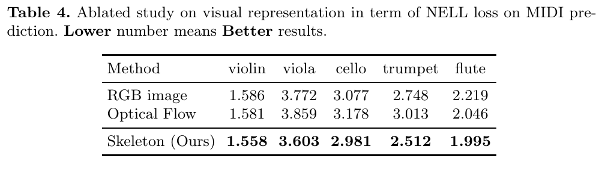

# IMU2Music: Learning to Generate Music from IMU Sensor Readings

In this project we will be exploring a way to generate music given IMU readings from a person playing an instrument.

## Project Goal and Vision

Our main goal is to explore different neural network architectures in the task of generating music by using only IMU readings from sensors present in musicians' bodies.

With the advent of diverse neural network architectures for the task of processing time sequences in the form of Recurrent Neural Networks (RNNs) and the variants that have been created since its inception, like Long Short-Term Memory (LSTM) architectures and transformers, among others, a plethora of uses have been engineered for these types of networks that go beyond classification tasks. One of these has been, for example, machine translation, in which the model converts one sequence of inputs into another, usually language-related. A further development has seen the creation of networks that translate a sequence from one sensor modality to another, which is the task we are undertaking in this project. We think that if successful in the task we are proposing, we could imagine applying the concept to other type of activities with similar constraints, where high dimensional features are detected by using only a few low dimensional sensor readings.

## Specific Aims

1. Obtain a dataset that captures musicians motion while performing, using Inertial Motion Sensors.
2. Design an extension to the musical transformer network used in both \[[4](#references)\] and \[[8](#references)\] so as to include IMU data.
3. Test different architectures for the encoder part of the transformer and compare quantitative and qualitative results.

## Previous Work

Previous work has dealt with, for example, translating images to speech, as in \[[1](#references)\], where an image is translated into a spoken description of it via a transformer that uses text as an intermediate modality. In \[[5](#references)\] the task was instead translating video to sound, where for videos with natural events a corresponding sound is produced using an RNN. In contrast, in \[[2](#references)\], the cross-modality is done between speech and face images, where the task is to produce a biometric system that identifies individuals based on one of the chosen modalities. More interesting work has been that done in MIT's Computer Science and Artificial Intelligence Laboratory, where, for example, in \[[3](#references)\], given a robot arm equipped with a touch sensor and a camera recording of a robot arm's motion, a bidirectional correspondence between these modalities is established by using conditional GANs. More related to our current task, in \[[4](#references)\] they are able to translate video recordings of musicians performing into the actual sound one would expect hearing, by means of a transformer. Finally, we have work like \[[6](#references)\] where the objective is to translate an audio recording of a musician performing into an animation of it, with the body dynamics included. This could be thought as the inverse of the task we are exploring in this work, using an LSTM network trained on videos, where keypoints are extracted from the bodies shown. Our work instead uses only IMU readings and tries to translate those into the respective audio recording.

## Technical Approach

The approach taken in here follows that used in Foley (\[[4](#references)\]), where their objetive was to translate body movements extracted from silenced video recordings of musicians playing their instruments into sound sequences that try to resemble the original ones. For this purpose they use a transformer architecture based on previous work (\[[8](#references)\]), although only the decoder part is used as such, as the encoder is replaced by a Graph CNN that captures the body dynamics of the performers based on previously extracted sequences of body keypoints. While the encoder does need to be different in our case, as we are using IMU readings instead, the decoder part is of interest to us as it is the part where the sound sequences are generated. Sound is represented by the Musical Instrument Digital Interface (MIDI) format, which helps the model learn the rules contained in music as it encodes sound as a sequence of structured events where timing, pitch and velocity (hardness of the note played) are taken into account. By using this representation, we can input a sequence of MIDI events into the transformer decoder and coupled with the motion information, predict a new MIDI event. The transformer architecture is specially helpful because of the self-attention modules which, given the common presence of recurrent elements in musical pieces that can repeat after large intervals of time, are able to take all of these relations into account. Finally, the original transformer architecture uses absolute position encoded into the input embeddings, but in this case relative positional representation is adopted to make sure the self-attention module takes into account the distance between nearby tokens, which is an advantage when dealing with music, as relative differences in timing and pitch matter more than absolute ones.

The first challenge in this work was searching for a dataset with IMU readings taken from musicians playing their instruments. Unfortunately, there is very little in this respect, i.e., there are datasets with IMU readings but applied to human activity recognition, not to musical tasks, or in the cases where musical activity is measured, either optical motion capture systems are used, or in the case of \[[9](#references)\], the IMU readings only comprise one of the arms of the subject, so that not all musical properties can be inferred. Thankfully, a dataset was found which consisted of musicians playing violin, where both electromyograph and IMU readings are taken, as well as optical motion capture and audio recordings. This dataset was collected in the context of the Technology Enhanced Learning of Music Instruments ([TELMI](http://telmi.upf.edu/)) project from the Music Technology Group of the Universitat Pompeu Fabra in Barcelona, which wanted to enhance musical learning by developing a suite of technology that guides students through that process. The problem is that the data is stored on separate files that link to [RepoVizz](https://repovizz.upf.edu/repo/Home), a multimodal online database and visualization tool, which requires some user interaction to choose which data streams to download from each file, instead of providing all the database in one file. This was solved by writing a small python script using Selenium that automates this retrieval of data. Because the transformer decoder expects MIDI as its input, the audio files were converted into MIDI files by using a Wave-to-Notes transcriber ([Waon](https://github.com/kichiki/WaoN)), which can let you also specify the desired pitch range, useful to limit the number of variables to process. But certain processing is needed first to clip audio files and IMU readings to remove both the initial and final silence intervals, as in those moments there is no music playing and there is no reason to keep those readings. Unfortunately, at the end of this process, it was revealed that the resulting dataset only contained in total 47.8 minutes of data, which when splitted into samples of 6 seconds to take as input to the model, resulted in only 478 samples in total, which is very small indeed. We are able to augment data by randomizing the initial start time of the samples, but nevertheless it is still small. 

Our dataset then consists of measurements from two different IMU sensors located each one on the forearm of a violinist which is supposed to be playing its instrument. Therefore, our architecture should take into account both local patterns from the individual sensors as well as global patterns computed across all sensors, and finally, the temporal patterns involving all sensors. That is why, inspired by the architecture presented in \[[10](#references)\], we designed an encoder for our transformer that incorporates both a convolutional and a recurrent segment. First of all, measurements from the IMU sensors are normalized, after which the magnitude of each of the sensors' readings is computed with respect to each of the axis values output by each sensor. These readings are divided according to the IMU to which they belong, and a specific time interval is used to subdivide the samples into smaller parts. This subsamples can be either processed directly or they can be transformed to the frequency domain and then passed to the convolutional network, so we tested for both cases. Each matrix representing the magnitude of the readings of each IMU for a certain interval of time is passed first to a convolutional subnetwork with three layers containing also batch normalization and ReLU activation functions. Note here that each sensor has its own instance of this subnetwork. Afterwards, the results from these layers are concatenated and passed through a final convolutional subnetwork with also three layers, batch normalization and ReLU activations. Finally, a fully connected network is used to map the resulting vector to one of a size that is concordant with the embedding space used with the transformer. Throughout these subnetworks different kernel sizes are used to extract different features. The output from the convolutional layers and fully connected layer is then passed to the transformer encoder and then to the decoder, where a final fully connected layer transforms the output size from the embedding size to the vocabulary size. The MIDI sequence used as input in the transformer decoder is passed through an embedding also, so that all inputs to the transformer have the same input size.

Data augmentation was necessary given the small size of the dataset, and it was implemented on both the MIDI input and the IMU input. For the MIDI input, the augmentation only consisted of shifting by a random number the notes' starting and ending time, while for the IMU, given the original files with samples that surpass the sample duration we are searching for, the augmentation consisted of randomly choosing a starting time from which to extract a subsample of a specific duration.

Finally, because there has been some discussion to whether transformers perform worse than LSTM with small datasets (\[[11](#references)\]), we decided to do some tests where we substitute the transformer with an LSTM encoder-decoder.

## Implementation

For training our network, we used Adam optimizer with a learning rate of 3e-4 and weight decay of 1e-5, 0.9 for beta 1 and 0.98 for beta 2, and epsilon factor of 1e-9. We use a minibatch of size 15. The MIDI event types considered for our inputs and outputs, were: note on/off events, which represent the time and pitch of a musical note when it is first generated and the time and pitch when it ends, time shift events, which are discretized into a certain number of bins that measure the time differences between events, and velocity events, which take into account the hardness of the note played. Each of these events is assigned a different number, therefore we have a number for each pitch, 88 pitches in total, a quantity multiplied by two so that we are able to indicate whether there is a note on or note off event; 32 different time shift events represented by distinct numbers, and 32 velocity indexes. To this total, we add three special event numbers that correspond to start of sequence, end of sequence and padding, so that in total we represent 243 events. Both MIDI events and IMU readings are represented with embeddings of a certain size to take as input to the transformer. Both the embedding size and the maximum sequence length of events considered for the input were varied according to the next quantities: \[128,256,512\]. 8 attention heads are used in the transformer and 6-second samples are used. The number of layers used for both encoder and decoder was fixed to 2, as we wanted to avoid increasing too much the number of parameters given our small dataset, but we also made tests varying these number of layers. We therefore framed the problem as a classification problem where during training the model has to predict the next event given the previous MIDI events and the current IMU readings, and Cross Entropy Loss is used to evaluate its performance. The dataset is divided so that 80% is for training, 10% for validation and another 10% for testing.

## Results

We use the results from \[[4](#references)\] as the baseline to compare our model. Their results are shown in the next image:

In this table they show their validation loss compared to other methods, according to different musical instruments. We are only interested on the last row and on the violin result, as our model is also trained to deal with violinists. One thing to note from this table is that we were not able to replicate their results, at least the ones corresponding to the violin, even when using their exact model cloned from their repository with almost no change, although the results were still good. That said, we present now our results:

Embedding size/Maximum sequence length | Val. Loss | Val. Accuracy
-------------------------------------- | ------ | ---------
128/128 | 3.190127 | 0.201736
256/256 | 3.373361 | 0.115365
512/512 | 3.880303 | 0.044054
128/512 | 3.297678 | 0.054384

In this first table we show both the validation loss and accuracy while using different embedding sizes and maximum input sequence lengths. As we can see from the results, as the maximum sequence length and embedding size increases, the accuracy drops as well as the loss increases, as the model has to predict a greater number of events per IMU readings and has to learn an embedding with more parameters, given our small dataset. But the interesting thing here is that if we increase the maximum sequence length but maintain the embedding size as 128, the loss doesn't increase that much with respect to the 128/128 case, while the accuracy does suffer. Qualitatively speaking, lower loss, not necessarily higher accuracy is what makes the music sound better, as we do not need the MIDI events to match perfectly, but just to resemble the original audio. But in this case, the best results in terms of the generated audio are indeed the ones that have lower loss and greater accuracy, meaning the best audio is generated with parameters 128/128 and the second best with 256/256. The problem with the model that has 128/512 sizes is that it only generates single notes for each 6 second sample, while the 512/512 shows some marks of modal collapse while generating similar notes for different inputs. The reason why at first we use the same embedding size as the maximum sequence length was to see if the two carried some relationship, as in the original model from \[[4](#references)\], both values were the same and we wanted to maintain that equivalence at first. 

Now we present another table where we show the same performance metrics as the past one, but in here we compare our different architectures:

Method | Val. Loss | Val. Accuracy
-------------------------------------- | ----- | ---------
LSTM | 4.116368 | 0.152430
ConvTransformer | 3.417947 | 0.180035
Transformer w frequency domain inputs | 3.235243 | 0.196701
Transformer w/o frequency domain inputs | 3.190127 | 0.201736
Transformer w FC | 3.148006 | 0.209896

We can see that while in \[[11](#references)\] they proved that smaller datasets work better with LSTM than transformers, in this case that was not true. We can also see that whether the input is given in frequency domain or not, the model doesn't obtain any benefit, quantitatively. The ConvTransformer is close to the baseline *transformer w/o frequency domain inputs*, but still suffers from greater loss and it has a lot more parameters than the other models, making it slower to train, so we can say it doesn't provide any benefit for now. Finally, we can see that by using a transformer with only a fully connected layer that takes as input our IMU readings and produces a sequence of embeddings ready to be used at the transformer encoder, surpasses all the other architectures, meaning that there is no need to incorporate any complex preprocessing for the IMU readings, or at least that is what one thinks if one is satisfied by the quantitative metrics. But qualitatively, by inspecting the generated audio files, by using a fully connected layout one can only produce single notes per 6 second samples, which is not what we are searching for. The other architectures are able to produce more complex arrangements (a small sequence of notes), and the best in this respect is the transformer without frequency domain inputs.

Finally, we present a table showing the loss and accuracy with respect to the number of layers in the encoder/decoder of the transformer:

Layers | Val. Loss | Val. Accuracy
---------------- | --------------- | -----------
2 | 3.190127 | 0.201736
4 | 3.122057 | 0.210069
6 | 3.214685 | 0.212326

In this table it is evident that using more layers doesn't necessarily result in a huge loss improvement, the problem is that when one hears the generated audio files, what can notice that the models with 4 and 6 layers are having modal collapse by producing exactly the same sound irrespective of the IMU readings. The best one, qualitatively, is instead the model with only 2 layers for encoder and 2 layers for decoder. This means we should be extra careful when basing our judgements only on the quantitative metrics, as the qualitative part may matter more.

A sample of audio recordings are available [here](https://github.com/kiototeko/IMU2Music/tree/main/data/recordings) to compare the original audio with the generated sound waves made by the model. The dataset tested in this section can be found [here](https://drive.google.com/file/d/1vhTIwrRSaCS34HZ3BVba0P6FgPPbeb-e/view?usp=sharing).

## Strengths

There certainly appears to be a relation between IMU readings from musicians performing and the sound being produced, although more data is necessary to ascertain this relationship. While the model does not reach the low cross-entropy loss levels of the violin from the baseline Foley paper results, it does reach levels close to the ones of other instruments, better than the viola at least. Qualitatively speaking, we can start hearing some semblance of the original recordings with our baseline model although more data should give us better insights. Finally, it is worth saying we are using a lower number of *body keypoints* compared to the Foley paper and obtaining not that bad results, this means that while they capture the whole body movement on videos and calculate numerous body keypoints, and use all that information as input, in our project it is as if we were only using two keypoints and obtaining *comparable* results, at least in loss terms. The benefits of us using IMU readings also is that we can capture more precise estimates of movement in all axes, and that is why we might also be able to more or less have *comparable* performance.

## Weaknesses

The results are partial given that we don't have enough data, so the possible inferences one can make of them is limited. This means the metrics we are presenting may not be that meaningful as the problem may be more the lack of training given the reduced dataset. The audio produced by the neural network is very simple: just a note in the worst results for each 6 second sample, and a sequence of notes in the best cases, but still not that close to the original recordings. Also, we observed some semblance of modal collapse when testing the more complex networks, meaning that the produced sound was always the same notwithstanding the different imu readings passed as input. Not only that, but the overall problem is also that for the task we are solving, which relies heavily on qualitative evaluation, quantitative metrics tell only half the story, so it is difficult to compare performance between models without it being subject to personal preferences.

## Future Directions

Given the tiny amount of data available to train a model using both IMU sensors and audio of musicians performing, an interesting future direction could deal with generating the IMU readings directly from videos of musicians so as to surpass this problem. In fact, in \[[7](#references)\] they do exactly that, although for the purpose of human activity recognition, testing both an LSTM and a Random Forest model. Unfortunately, their code is not open to the public so we are not able to test it for now. We can also try substituting the transformer with a conditional generative adversarial network, as was tried in \[[12](#references)\] for the task of synthesizing accelerometer data from video data of human activities. If synthesizing data is not an option, further work should try to collect data by persuading people to be equipped with IMU sensors when playing an instrument.

Finally, further work should try experimenting with sample lengths, embedding sizes, maximum length of sequences, number of layers, etc., whenever more data is available. 

## Slides

Slides can be accessed [here](https://github.com/kiototeko/IMU2Music/blob/main/slides.pdf) .

## References

\[1\] Ma, S., Mcduff, D., & Song, Y. (2019, October). Unpaired Image-to-Speech Synthesis With Multimodal Information Bottleneck. 2019 IEEE/CVF International Conference on Computer Vision (ICCV). 2019 IEEE/CVF International Conference on Computer Vision (ICCV). [https://doi.org/10.1109/iccv.2019.00769 ](https://doi.org/10.1109/iccv.2019.00769)

\[2\] Arsha Nagrani, Samuel Albanie, Andrew Zisserman. Seeing Voices and Hearing Faces: Cross-Modal Biometric Matching (2018). Proceedings of the IEEE Conference on Computer Vision and Pattern Recognition (CVPR), 2018, pp. 8427-8436. [https://openaccess.thecvf.com/content_cvpr_2018/html/Nagrani_Seeing_Voices_and_CVPR_2018_paper.html](https://openaccess.thecvf.com/content_cvpr_2018/html/Nagrani_Seeing_Voices_and_CVPR_2018_paper.html)

\[3\] Yunzhu Li, Jun-Yan Zhu, Russ Tedrake, Antonio Torralba. Connecting Touch and Vision via Cross-Modal Prediction (2019). Proceedings of the IEEE/CVF Conference on Computer Vision and Pattern Recognition (CVPR), 2019, pp. 10609-10618. [https://openaccess.thecvf.com/content_CVPR_2019/html/Li_Connecting_Touch_and_Vision_via_Cross-Modal_Prediction_CVPR_2019_paper.html](https://openaccess.thecvf.com/content_CVPR_2019/html/Li_Connecting_Touch_and_Vision_via_Cross-Modal_Prediction_CVPR_2019_paper.html)

\[4\] Chuang Gan and Deng Huang and Peihao Chen and Joshua B. Tenenbaum and Antonio Torralba (2020). Foley Music: Learning to Generate Music from Videos. [https://arxiv.org/abs/2007.10984](https://arxiv.org/abs/2007.10984)

\[5\] Yipin Zhou, Zhaowen Wang, Chen Fang, Trung Bui, Tamara L. Berg (2018). Visual to Sound: Generating Natural Sound for Videos in the Wild. Proceedings of the IEEE Conference on Computer Vision and Pattern Recognition (CVPR), 2018, pp. 3550-3558. [https://openaccess.thecvf.com/content_cvpr_2018/html/Zhou_Visual_to_Sound_CVPR_2018_paper.html](https://openaccess.thecvf.com/content_cvpr_2018/html/Zhou_Visual_to_Sound_CVPR_2018_paper.html)

\[6\] Eli Shlizerman, Lucio Dery, Hayden Schoen, Ira Kemelmacher-Shlizerman (2018). Audio to Body Dynamics. Proceedings of the IEEE Conference on Computer Vision and Pattern Recognition (CVPR), 2018, pp. 7574-7583. [https://openaccess.thecvf.com/content_cvpr_2018/html/Shlizerman_Audio_to_Body_CVPR_2018_paper.html](https://openaccess.thecvf.com/content_cvpr_2018/html/Shlizerman_Audio_to_Body_CVPR_2018_paper.html)

\[7\] Kwon, H., Tong, C., Haresamudram, H., Gao, Y., Abowd, G. D., Lane, N. D., & Plötz, T. (2020). IMUTube. Proceedings of the ACM on Interactive, Mobile, Wearable and Ubiquitous Technologies, 4(3), 1–29. [https://doi.org/10.1145/3411841](https://doi.org/10.1145/3411841)

\[8\] Cheng-Zhi Anna Huang and Ashish Vaswani and Jakob Uszkoreit and Noam Shazeer and Ian Simon and Curtis Hawthorne and Andrew M. Dai and Matthew D. Hoffman and Monica Dinculescu and Douglas Eck (2018). Music Transformer. [https://arxiv.org/abs/1809.04281](https://arxiv.org/abs/1809.04281)

\[9\] Sarasúa, Á., Caramiaux, B., Tanaka, A., & Ortiz, M. (2017, June 28). Datasets for the Analysis of Expressive Musical Gestures. Proceedings of the 4th International Conference on Movement Computing. MOCO ’17: 4th International Conference on Movement Computing. [https://doi.org/10.1145/3077981.3078032](https://doi.org/10.1145/3077981.3078032)

\[10\] Yao, S., Hu, S., Zhao, Y., Zhang, A., & Abdelzaher, T. (2017, April 3). DeepSense. Proceedings of the 26th International Conference on World Wide Web. WWW ’17: 26th International World Wide Web Conference. [https://doi.org/10.1145/3038912.3052577](https://doi.org/10.1145/3038912.3052577)

\[11\] Aysu Ezen-Can (2020). A Comparison of LSTM and BERT for Small Corpus. [https://arxiv.org/abs/2009.05451](https://arxiv.org/abs/2009.05451)

\[12\] Zhang, S., & Alshurafa, N. (2020, September 10). Deep generative cross-modal on-body accelerometer data synthesis from videos. Adjunct Proceedings of the 2020 ACM International Joint Conference on Pervasive and Ubiquitous Computing and Proceedings of the 2020 ACM International Symposium on Wearable Computers. UbiComp/ISWC ’20: 2020 ACM International Joint Conference on Pervasive and Ubiquitous Computing and 2020 ACM International Symposium on Wearable Computers. [https://doi.org/10.1145/3410530.3414329](https://doi.org/10.1145/3410530.3414329)
